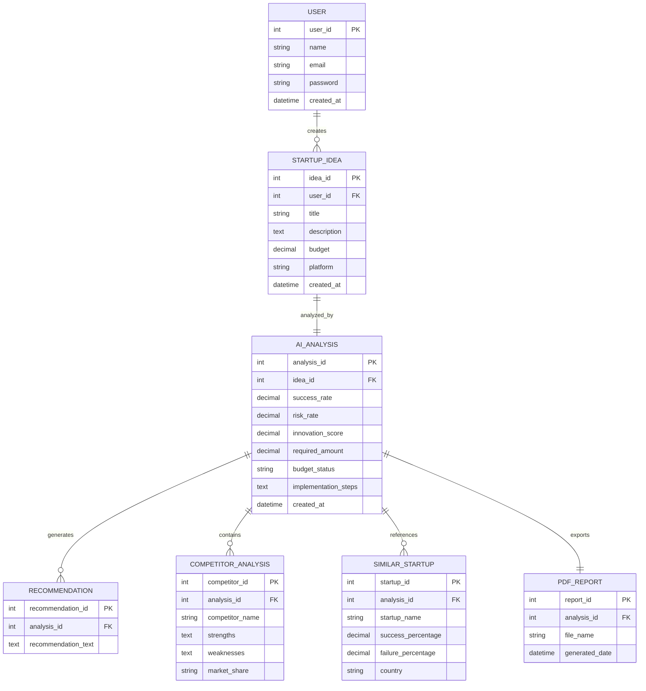

# Startup Incubator AI - ER Diagram

```mermaid
erDiagram

    USER ||--o{ STARTUP_IDEA : creates
    STARTUP_IDEA ||--|| AI_ANALYSIS : analyzed_by
    AI_ANALYSIS ||--o{ RECOMMENDATION : generates
    AI_ANALYSIS ||--o{ COMPETITOR_ANALYSIS : contains
    AI_ANALYSIS ||--o{ SIMILAR_STARTUP : references
    AI_ANALYSIS ||--|| PDF_REPORT : exports

    USER {
        int user_id PK
        string name
        string email
        string password
        datetime created_at
    }

    STARTUP_IDEA {
        int idea_id PK
        int user_id FK
        string title
        text description
        decimal budget
        string platform
        datetime created_at
    }

    AI_ANALYSIS {
        int analysis_id PK
        int idea_id FK
        decimal success_rate
        decimal risk_rate
        decimal innovation_score
        decimal required_amount
        string budget_status
        text implementation_steps
        datetime created_at
    }

    RECOMMENDATION {
        int recommendation_id PK
        int analysis_id FK
        text recommendation_text
    }

    COMPETITOR_ANALYSIS {
        int competitor_id PK
        int analysis_id FK
        string competitor_name
        text strengths
        text weaknesses
        string market_share
    }

    SIMILAR_STARTUP {
        int startup_id PK
        int analysis_id FK
        string startup_name
        decimal success_percentage
        decimal failure_percentage
        string country
    }

    PDF_REPORT {
        int report_id PK
        int analysis_id FK
        string file_name
        datetime generated_date
    }
```
