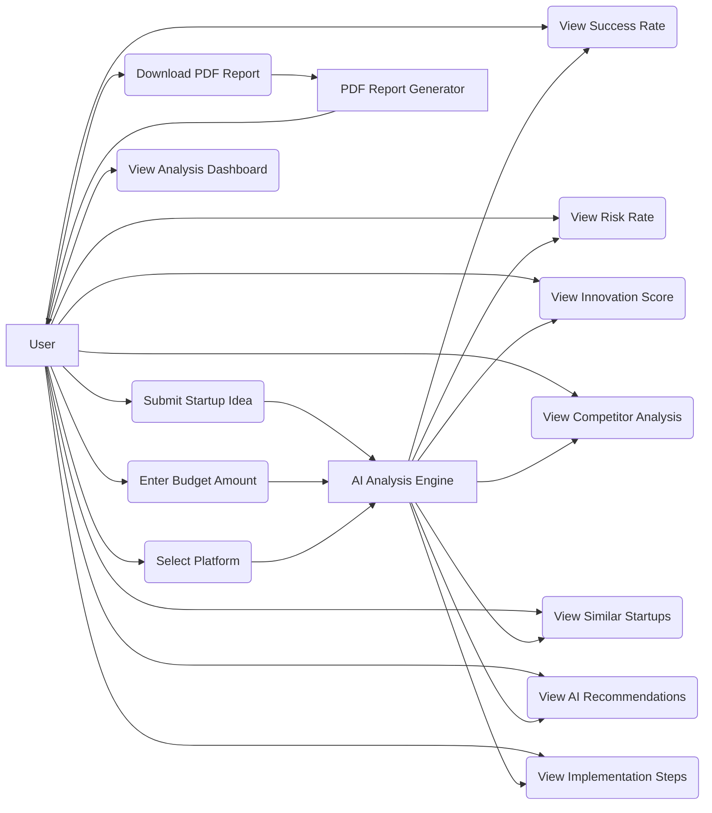

# Startup Incubator AI - Use Case Diagram

```mermaid
flowchart LR

    U[User]
    AI[AI Analysis Engine]
    PDF[PDF Report Generator]

    U --> UC1(Submit Startup Idea)
    U --> UC2(Enter Budget Amount)
    U --> UC3(Select Platform)
    U --> UC4(View Analysis Dashboard)
    U --> UC5(View Success Rate)
    U --> UC6(View Risk Rate)
    U --> UC7(View Innovation Score)
    U --> UC8(View Competitor Analysis)
    U --> UC9(View Similar Startups)
    U --> UC10(View AI Recommendations)
    U --> UC11(View Implementation Steps)
    U --> UC12(Download PDF Report)

    UC1 --> AI
    UC2 --> AI
    UC3 --> AI

    AI --> UC5
    AI --> UC6
    AI --> UC7
    AI --> UC8
    AI --> UC9
    AI --> UC10
    AI --> UC11

    UC12 --> PDF
    PDF --> U
```
